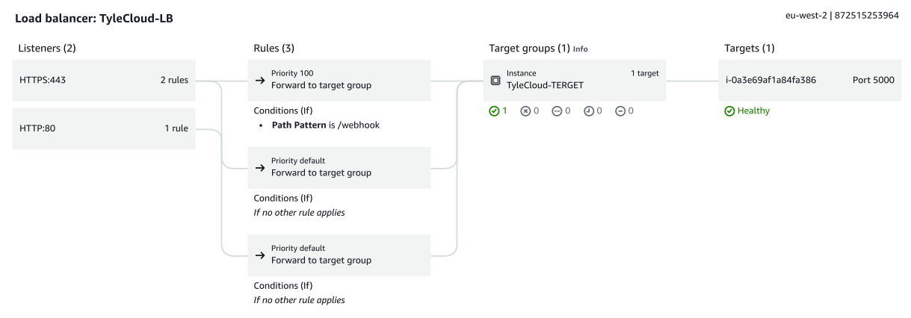

# TyleDeClouds AWS Cloud Consulting Portfolio

A professional portfolio website showcasing TyleDeClouds AWS Cloud Consulting services, highlighting technical implementations, project screenshots, and cloud architecture solutions.



## Overview

This project is a responsive, modern portfolio website for TyleDeClouds, an AWS cloud consulting service based in Ashford, United Kingdom. The website showcases AWS infrastructure implementations, cloud architecture solutions, and technical expertise through a clean, professionally designed interface.

## Features

- **Responsive Design**: Fully responsive layout that works on mobile, tablet, and desktop devices
- **Project Showcase**: Comprehensive gallery of AWS implementation screenshots
- **Implementation Details**: Detailed explanations of AWS services configuration including:
  - AWS Lambda Functions
  - Load Balancer Configuration
  - IAM Permissions & VPC Configuration
  - Email Templates
  - Stripe Integration
- **Technical Implementation**: Code samples and architecture diagrams
- **Contact Information**: Direct communication channels with the consultant

## Technologies Used

### Frontend
- React.js
- Tailwind CSS
- Shadcn UI Components

### Backend
- Express.js (Node.js)
- Vite (for development and building)

### AWS Services Showcased
- AWS Lambda
- Elastic Load Balancer
- IAM Roles and Permissions
- VPC Configuration
- Secrets Manager
- SQS (Simple Queue Service)
- CloudWatch

## Getting Started

### Prerequisites
- Node.js (v16 or higher)
- npm (v7 or higher)

### Installation

1. Clone the repository:
```bash
git clone https://github.com/Taiwo-peter/TyLeDeClouds.py.git
cd TyLeDeClouds.py
```

2. Install dependencies:
```bash
npm install
```

3. Start the development server:
```bash
npm run dev
```

4. Open your browser and navigate to:
```
http://localhost:5000
```

### Building for Production

To create a production build:

```bash
npm run build
```

To start the production server:

```bash
npm run start
```

## Project Structure

```
├── attached_assets/   # Images and assets used throughout the website
├── client/            # Frontend React application
│   ├── src/           # React source code
│   │   ├── components/ # Reusable UI components
│   │   ├── hooks/     # Custom React hooks
│   │   ├── lib/       # Utility functions
│   │   ├── pages/     # Page-level components
│   │   ├── App.tsx    # Main application component
│   │   └── main.tsx   # Application entry point
│   └── index.html     # HTML template
├── server/            # Backend Express application
│   ├── index.ts       # Server entry point
│   ├── routes.ts      # API route definitions
│   └── vite.ts        # Vite integration for development
├── shared/            # Shared code between frontend and backend
│   └── schema.ts      # Database schema definitions
└── package.json       # Project dependencies and scripts
```

## Customization

To modify the website content:

- **Update Contact Information**: Edit the `Contact.tsx` component
- **Modify Project Screenshots**: Edit the `Screenshots.tsx` component
- **Change Implementation Details**: Edit the `Implementation.tsx` component

## Deployment

The application is configured for easy deployment to various platforms:

### Replit

The application is preconfigured for Replit deployment with:
- Port mapping
- Workflow configurations
- Build and run scripts

### Traditional Hosting

1. Build the application using `npm run build`
2. Deploy the `dist` directory to your hosting provider
3. Ensure the server is configured to serve both static files and the API endpoints

## Contact

For questions about this project, please contact:
- Email: tyledeclouds@gmail.com
- Location: Ashford, United Kingdom
- GitHub: https://github.com/Taiwo-peter/TyLeDeClouds.py.git

## License

This project is licensed under the MIT License - see the LICENSE file for details.